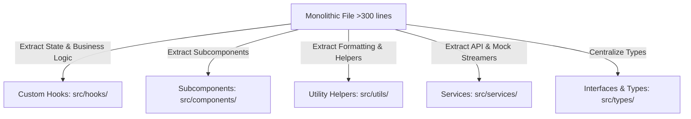

# Code Reviewer & Organizer Skill: Clean Architecture & Conventional Structuring

This skill guides the agent to systematically analyze, audit, clean, and reorganize codebases. By invoking this skill, you enforce robust software design patterns (SOLID, DRY, modularity), secure sensitive properties, boost performance, ensure full TypeScript safety, and restructure large files into elegant, maintainable layouts.

---

## 1. Core Principles of Code Quality

When reviewing or refactoring code, always aim for:
- **Separation of Concerns**: Decouple logic (business rules, API services, custom hooks) from rendering (React components).
- **Single Responsibility (SRP)**: Each component, function, or file should do exactly one thing well.
- **Strict Type Safety**: Eliminate `any` types. Maximize contract enforcement via robust TypeScript interfaces and schemas.
- **Defensive Design**: Wrap asynchronous boundaries, user inputs, and local storage read/writes with rigorous error boundaries and loading/empty fallback UI states.
- **Conventional Structuring**: Keep folders organized and predictably scaffolded according to project blueprints (such as `AGENTS.md`).

---

## 2. Comprehensive Code Review Dimensions

Evaluate the target codebase along five critical axes:

### A. Correctness & Error Boundary Safety
- **Nullable & Undefined Handling**: Verify that components safely handle missing parameters or slow-loading state using optional chaining (`?.`) and nullish coalescing (`??`).
- **Asynchronous Boundaries**: Ensure every network call, WebSocket connection, or local storage lookup is encased in a `try-catch` block or handles promises using `.catch()`.
- **React State Syncing**: Double-check that state transformations are handled synchronously or in reactive `useEffect` hooks with proper dependencies to prevent staleness.

### B. Efficiency & Performance Optimization
- **Render Optimizations**: Flag unnecessary re-renders in React components. Recommend memoization utilities (`useMemo`, `useCallback`) for heavy computations or function dependencies.
- **Resource Lifecycle Management**: Ensure that every setup event (e.g. `setInterval`, `addEventListener`, WebSocket subscription) in a `useEffect` has a corresponding **cleanup function** to prevent memory leaks.
- **Data Structure Selection**: Ensure search operations utilize Maps or Sets ($O(1)$) instead of scanning large arrays repeatedly ($O(N)$).

### C. Security & Credential Isolation
- **Secrets Scanning**: Verify no passwords, API keys, credentials, or secure configuration endpoints are hardcoded in the codebase.
- **Isolation Check**: Ensure all configurations are loaded securely using `.env` variables and documented in a `.env.example` file.
- **Input Sanitization**: Make sure text inputs, query arguments, and URL parameters are sanitized to prevent scripting vulnerabilities (XSS) or query injections.

### D. Readability & Clean Code Conventions
- **File Length Limits**: Files exceeding **300 lines** should be prioritized for extraction and refactoring.
- **Logic Nesting Depth**: Flag logic that nests more than 3 levels deep (e.g., deeply nested loops or conditional switches). Refactor these using early returns (guard clauses) or by delegating to helper functions.
- **Naming Conventions**: Enforce standard patterns:
  - `PascalCase` for React components and page directories (e.g., `ViewerApp.tsx`).
  - `camelCase` for variables, utilities, helper functions, and custom hooks (e.g., `useAquariumData.ts`).
  - `UPPER_SNAKE_CASE` for global constant variables (e.g., `DEFAULT_CLARITY_LIMIT`).

### E. TypeScript Quality & Type Integrity
- **No Implicit `any`**: Ensure there are no declarations relying on implicit or explicit `any`. Define strong, descriptive interfaces.
- **Type Duplication**: Group and export shared TypeScript interfaces or type aliases into dedicated domain-specific schemas (e.g., `src/types/`) or core service boundaries.

---

## 3. Playbook: Code Health Scanning

To analyze the structural shape of a workspace and detect architectural violations, follow this sequence:

### Step 1: Scan the Codebase
Execute the custom Code Health Review Scanner script to gather structural metadata and pinpoint code smells.

```powershell
# Run the scanner on the default src/ directory
node .agents/skills/code-reviewer/scripts/code_health_checker.cjs
```

### Step 2: Formulate the Refactoring Plan
Based on the scanner's output and manual review, compile a **Code Review & Reorganization Plan** (formatted as a markdown artifact). The plan must outline:
1. **Identified Smells**: A list of monolithic files, naming violations, or type-safety issues.
2. **Target Architecture**: A list of planned component extractions, custom hooks, and utility modules.
3. **Phased Action Steps**: A sequential, dependency-ordered roadmap representing discrete atomic edits.

---

## 4. Playbook: Reorganization & Modularization

When executing the reorganization, apply the following modularization patterns:



### Pattern A: Decoupling State (Custom Hooks)
Extract state variables, API subscriptions, and Firestore/localStorage event listeners out of UI components and into modular custom hooks (e.g., `src/hooks/useAquariumData.ts`).
*   *Before*: A page component handles state setup, loading conditions, stream subscriptions, formatting, and rendering in a single 600-line file.
*   *After*: The page component invokes `const { liveData, isLoading, error } = useAquariumData();` and focuses entirely on structural styling and component placement.

### Pattern B: Extracting Subcomponents
Split layout-heavy page views into atomic UI units:
1. Identify high-level panels or cards inside a large page (e.g., `FishTable`, `MetricsGrid`, `LiveFeedViewport`).
2. Move them into separate files inside `src/components/` (or a local page-specific folder if not shared).
3. Type their incoming parameters explicitly using exact React props interfaces.

### Pattern C: Service Layer Extraction
Ensure components do not directly stream data or communicate with backends.
- Keep all communication layers, Firestore adapters, mock streams, or WebSocket triggers inside modules in `src/services/`.
- Let components or custom hooks consume these services through standard asynchronous return contracts or subscription handles.

### Pattern D: Utility Separation
Move math operations, color generators, date-time formatters, and clean filters into stateless, pure functions in `src/utils/` files. These files have no React dependencies and are easily testable.

---

## 5. Reorganization Safeguards (DoD)

To ensure high-quality refactoring without breaking existing features, adhere to the following checklist during every reorganization step:

1.  **Atomic Commits & Changes**: Apply refactoring iteratively. Do not attempt to rewrite the entire project at once. Refactor one component or hook at a time, update its imports, and verify compilation.
2.  **No Dead Imports**: After moving folders or files, use a compiler check to catch stale import declarations or broken relative paths.
3.  **Strict Type Compliance**: The codebase must compile cleanly under TypeScript. Run:
    ```powershell
    # Verify no compilation errors
    npm run build
    ```
4.  **Lint & Formatter Conformity**: Always run your project's linting commands after reorganizing files to verify code styles remain intact:
    ```powershell
    # Check for formatting and syntax lints
    npm run lint
    ```
5.  **Preserve Original Behavior**: Refactoring must change the structure, *not* the behavior. Always verify the application runs identically before and after your refactoring phases by inspecting user flows or running tests.
